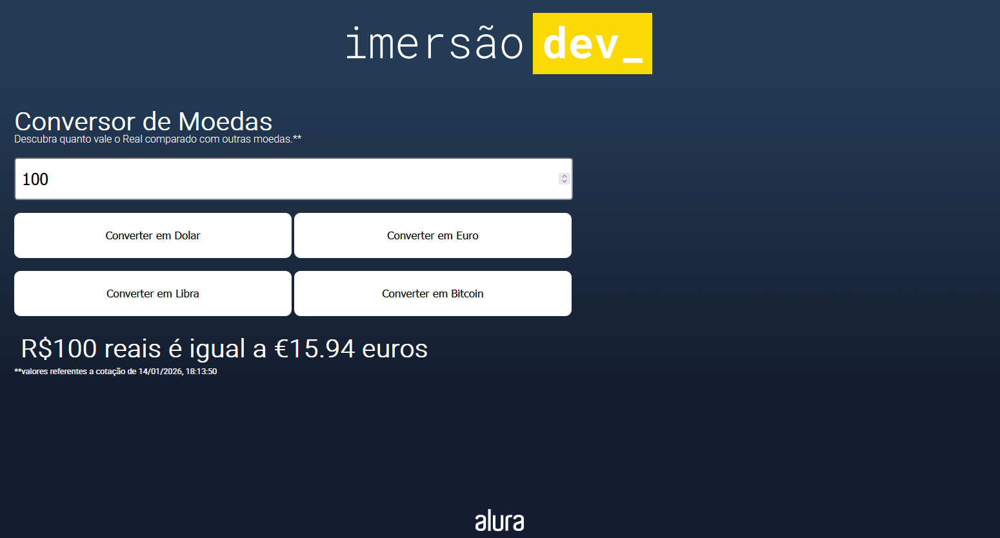

 

  <a href="https://imersao.dev/">
    
  </a> 
  
  

  
# 💰 Conversor de Moedas
Este projeto é um conversor de moedas dinâmico. A aplicação permite que o usuário insira um valor em Reais (BRL) e obtenha a conversão instantânea para outras moedas, utilizando cotações reais atualizadas via API.
  
## 🚀 Funcionalidades
A página é capaz de realizar as seguintes conversões:
* **Real para Dólar Americano (USD)**.
* **Real para Euro (EUR)**.
* **Real para Libra Esterlina (GBP)**.
* **Real para Bitcoin (BTC)**.
  
## 💻 Como Visualizar

O projeto pode ser acessado diretamente através do GitHub Pages: 👉 https://raphaelsette.github.io/alura-currencyconverter/

## 📝 Referências

 - <a href="https://developer.mozilla.org/pt-BR/docs/Web/JavaScript/Guide/Expressions_and_operators" target="_blank">MDN - Operadores boleanos</a>
 - <a href="https://developer.mozilla.org/pt-BR/docs/Web/JavaScript/Reference/Global_Objects/parseFloat" target="_blank">MDN - parseFloat</a>
 - <a href="https://developer.mozilla.org/pt-BR/docs/Web/JavaScript/Guide/Grammar_and_types#vari%C3%A1veis" target="_blank">MDN - Sintaxe e Variáveis</a>
 - <a href="https://sweetalert2.github.io/" target="_blank">Documentação Sweetalert2</a>
 - <a href="https://developer.mozilla.org/pt-BR/docs/Web/JavaScript" target="_blank">Documentação JavaScript</a>
 - <a href="https://docs.awesomeapi.com.br/api-de-moedas" target="_blank">Documentação Awesomeapi (API de Cotações)</a>
